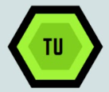

# Website Labeler Chrome Extension

   <!-- Make sure to replace this with the correct path to your logo -->
  @techunsatisfied

## Overview of the Project

In today’s digital world, we often find ourselves navigating a vast array of websites for various purposes, whether for research, work, or personal interest. However, keeping track of important websites can be challenging. Users frequently struggle to organize their bookmarks, leading to cluttered browsers and wasted time searching for previously visited sites.

### Problem Statement

- **Information Overload**: Users often visit many sites and may forget the importance or purpose of each.
- **Disorganized Bookmarks**: Traditional bookmarking systems often lack categorization, making it difficult to retrieve specific sites quickly.
- **Time Wasted Searching**: The inability to easily find important websites can lead to frustration and decreased productivity.

### Our Solution

The **Website Labeler Chrome Extension** addresses these challenges by providing a simple and effective way to label and categorize websites. With our extension, users can:

- **Label Websites**: Assign custom labels (like "Important" or "Research") to websites, making it easier to remember their significance.
- **Save Current Websites**: Quickly save the currently active website with a user-defined label, streamlining the process of organizing resources.
- **Easily Manage Saved Links**: View all saved websites in one place, and delete any that are no longer needed.

By enhancing how users manage their online resources, the Website Labeler Chrome Extension improves productivity and helps maintain a more organized digital workspace.

## Features

- **Labeling System**: Save websites with custom labels.
- **Current Website Save**: Quickly save the currently active website.
- **Delete Links**: Remove any saved link easily.
- **User-Friendly Interface**: A simple and interactive UI for managing saved websites.

## Screenshots

